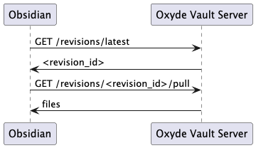
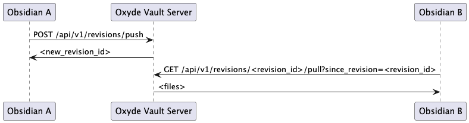
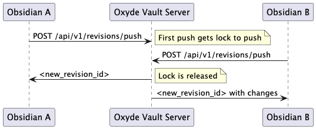

# Oxyde Vault

Oxyde Vault is an Obsidian plugin to sync your Obsidian notes into a self-hosted web-server synced with Git.

The plugin is designed to sync data smoothly, with automatic conflict resolution. The setup of the plugin and self-hosted server is designed to be simple and effortless.

# Architecture

The system consists of three main components:
- Obsidian Plugin (Client): Tracks file modifications, deletions, and creations. It communicates with the Rust server via REST APIs, tracking only the last known "sync revision".
- Rust Web Container (Server): It maintains a local clone of the remote repository, processes incoming changes, handles merges, and pushes to the Git server.
- Git server (Remote): The ultimate source of truth and backup.

# Flows

## Initial synchronization



## Push changes (single client)



## Push changes (multiple clients)



# APIs

## GET /api/v1/revisions/latest
- Response:

```json
{
  "revision_id": "<revision_id>"
}
```

## GET /api/v1/revisions/<revision_id>/pull?since_revision=<revision_id>&page=<page_id>
- Response:

  - 200 - Success:

```json
{
  "revision_id": "<revision_id>",
  "files": [
    {
      "path": "Notes/Idea.md",
      "status": "modified",
      "content": "Base64 encoded string..."
    },
    {
      "path": "Notes/Idea.md",
      "status": "added",
      "content": "Base64 encoded string..."
    },
    {
      "path": "Notes/Idea.md",
      "status": "deleted"
    }
  ],
  "page": "<page_id>"
}
```

  - 404 - Not found

## POST /api/v1/revisions/push
- Body:

```json
{
  "base_revision_id": "<revision_id>",
  "changes": [
    {
      "path": "Notes/Idea.md",
      "status": "modified",
      "content": "Base64 encoded string..."
    },
    {
      "path": "Notes/Idea.md",
      "status": "added",
      "content": "Base64 encoded string..."
    },
    {
      "path": "Notes/Idea.md",
      "status": "deleted"
    }
  ]
}
```

- Response:

  - 200 - Success:

```json
{
  "revision_id": "<revision_id>",
  "changes": [
    {
      "path": "Notes/Idea.md",
      "status": "modified",
      "content": "Base64 encoded string..."
    },
    {
      "path": "Notes/Idea.md",
      "status": "added",
      "content": "Base64 encoded string..."
    },
    {
      "path": "Notes/Idea.md",
      "status": "deleted"
    }
  ],
  "conflict_files": [
    {
      "path": "Notes/Idea.md",
      "content": "Base64 encoded string file before changes"
    }
  ]
}
```
